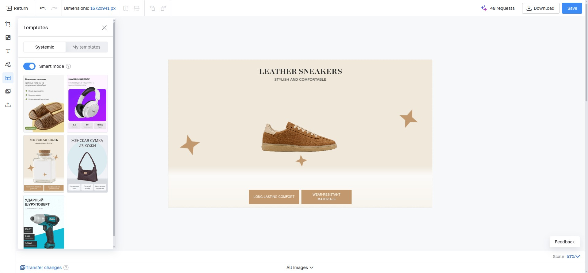
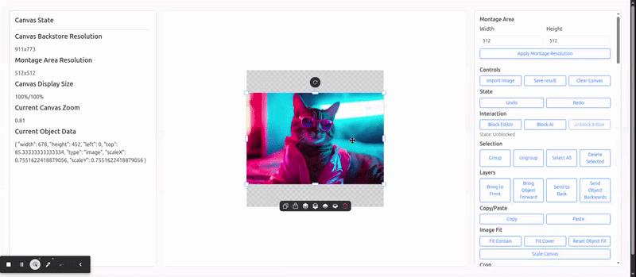
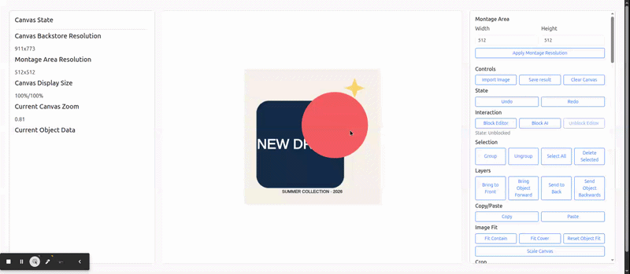
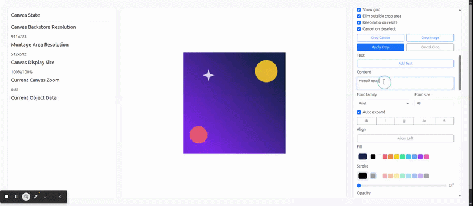

# Fabric Image Editor

[](https://github.com/Anu3ev/image-editor/actions/workflows/test.yml)
[](https://www.npmjs.com/package/@anu3ev/fabric-image-editor)
[](https://github.com/Anu3ev/image-editor/actions/workflows/test.yml)
[](./LICENSE)

**An image editor you can build into your web application.**

Let users crop images, add text and shapes, work with layers, reuse compositions, and export the result. Built with TypeScript and [Fabric.js](https://fabricjs.com/), the library provides editing tools, undo/redo, and state restoration through an API you can connect to your own interface.

🚀 **[Live Demo](https://anu3ev.github.io/image-editor/)** · [Integration guide](./guides/integration.md)

## Why this project matters

Users can prepare and revise images without leaving your application.

Examples of where an integrated editor can fit:

| Your application | What users can do with an integrated editor |
| --- | --- |
| E-commerce administration | Prepare product images with captions, promotional labels, and a consistent layout. |
| CMS or publishing tools | Crop and compose an illustration while preparing an article or page. |
| Marketing tools | Reuse a saved composition and change its text, images, or background. |
| Applications with AI image generation | Edit the generated image before saving it. The application supplies the AI service. |

## Built with this library



I built this TypeScript/FabricJS library and integrated it into the production Vue image editor at inSales. I owned the frontend architecture and implementation, working from prepared Figma designs and defining API contracts with the backend engineer.

The library provides canvas editing, history, and serialization. The product-specific Vue interface, backend, and AI features shown in the case belong to the host application and are not included in the npm package.

[More project details on LinkedIn](https://www.linkedin.com/in/alexander-s-anufriev/details/projects/)

## See it in action

The live demo exercises the same workflows exposed through the public API.

### Crop flow



### Layers and history



### Text styling



## For hiring managers

This repository demonstrates practical work with:

- stateful browser interactions built on top of a canvas runtime;
- editing with undo/redo, serialization, template restore, and export;
- modular TypeScript architecture with explicit manager ownership;
- public APIs and events designed for host-application integration;
- regression coverage for interaction-heavy scenarios such as crop, selection, scaling, snapping, and text editing.

## Integration services

I can integrate this editor into your application and adapt it to your workflow.

This can include image loading and saving, custom tools, editor open/close lifecycle, and error handling in your application.

I also provide support during integration and after launch, including troubleshooting, maintenance, and further development. We can agree on the scope and support arrangements around your product's needs.

[Contact me on LinkedIn](https://www.linkedin.com/in/alexander-s-anufriev/) to discuss your integration.

## ✨ Features

### Core Editing
- **Montage Area** - Dedicated workspace with clipping region for precise cropping
- **Canvas & Image Cropping** - Interactive crop mode for montage resizing and raster image cropping
- **Multi-layer Support** - Layer management with ordering, visibility, and locking
- **History System** - Full undo/redo with state management
- **Rich Text Editing** - Text manager with typography controls, uppercase transforms, and history-aware updates
- **Object Transformations** - Zoom, rotate, flip, fit, and scale operations
- **Professional Tools** - Copy/paste, grouping, selection, and alignment

### Advanced Capabilities
- **Background Management** - Color, multi-stop gradient, and image backgrounds
- **Image Import/Export** - Import PNG, JPEG, WebP, and SVG; export PNG, JPEG, WebP, SVG, and PDF
- **Precision Alignment** - Snapping to montage edges/centers and nearby objects with visual guides and spacing detection
- **Live Measurements** - Hold `Alt` with a selection to display distance guides to the hovered object or montage area
- **Web Worker Integration** - Heavy operations run in background threads
- **Font Loader** - FontManager handles Google Fonts + custom sources with automatic `@font-face` registration
- **Configurable Toolbar** - Dynamic toolbar with context-sensitive actions
- **Clipboard Integration** - Native copy/paste support with system clipboard
- **Deletion Guards** - Application-defined rules can prevent user deletion for protected objects
- **Clone Preparation** - Applications can sanitize object clones before copy, paste, duplicate, or cut

### Developer Features
- **TypeScript Support** - Full type definitions included
- **Modular Architecture** - Clean separation of concerns with manager classes
- **Event System** - Rich event handling for integration
- **Responsive Design** - Adapts to different screen sizes and containers
- **Testing Infrastructure** - Jest test suite with 80%+ coverage

## 📦 Installation

```bash
npm install @anu3ev/fabric-image-editor
```

**Requirements:**
- Node.js ≥ 20.0.0
- NPM ≥ 9.0.0
- Browser with ES2022 support and the APIs listed in [Browser Support](#-browser-support)

## 🚀 Quick Start

Add a container to your page:

```html
<div id="editor"></div>
```

Initialize the editor after the container is mounted:

```typescript
import initEditor from '@anu3ev/fabric-image-editor'

/** Editor instance owned by this page or component. */
const editor = await initEditor('editor', {
  montageAreaWidth: 512,
  montageAreaHeight: 512,
  editorContainerWidth: '100%',
  editorContainerHeight: '600px',
  fonts: []
})
```

`fonts: []` skips the default font downloads. Call `editor.destroy()` when the owning page or component is removed.

See the [integration guide](./guides/integration.md) for configuration, image import/export, text, shapes, cropping, and other editing operations.

### Library language

Pass `language` when creating an editor. English (`en`) is the default and
fallback; Russian (`ru`) is also bundled. Missing translations resolve through
the exact regional locale, its base language, then English. Locale codes are
case-insensitive, and unsupported languages fall back to English.

```ts
const editor = await initEditor('editor', { language: 'ru' })
```

Add locales or partially override built-in ones with `customLanguages`. Use
`EditorLocale` for nested key completion; every key is optional and accepts a
translated string. See the [full English catalog](./src/editor/i18n/en.ts) for
available keys and interpolation placeholders.

```ts
import initEditor, { type EditorLocale } from '@anu3ev/fabric-image-editor'

const portuguese = {
  ui: { toolbar: { delete: 'Excluir', duplicate: 'Duplicar' } }
} satisfies EditorLocale

const editor = await initEditor('editor', {
  language: 'pt-BR',
  customLanguages: { pt: portuguese }
})
```

`CustomLanguages` is also exported for typing a map of locale codes to catalogs.
Partial overrides such as `{ ru: { ui: { toolbar: { delete: 'Убрать' } } } }`
preserve other built-in translations. Resources are copied for each editor, so
one instance's customizations never affect another.

Each instance has its own i18next translator. The language is fixed at
initialization; create a new instance to choose another language. Built-in
toolbar labels, indicators, default inserted text, and export filenames use that
language. Library-generated technical errors, error-event messages, console logs,
warnings, and diagnostics remain in English and are not part of the `EditorLocale`
override schema. Caller-provided messages and external errors are preserved. Your
text, custom toolbar labels, serialized content, event names, and error codes stay
unchanged. The demo remains English-only.

## 🎮 Demo Application

The repository includes a development demo for trying library operations. See [Run the demo from source](./CONTRIBUTING.md#run-the-demo-from-source) for local setup.

Visit the demo at: **https://anu3ev.github.io/image-editor/**

## 🏗️ Architecture

The editor follows a modular architecture with specialized managers:

### Core Managers
- **`ImageManager`** - Image import/export, format handling, PDF generation
- **`CanvasManager`** - Canvas sizing, scaling, and viewport management
- **`HistoryManager`** - Undo/redo functionality with state persistence
- **`TextManager`** - Text object creation, styling, uppercase handling, and history integration
- **`LayerManager`** - Object layering, z-index management, send to back/front
- **`BackgroundManager`** - Background colors, gradients, and images
- **`CropManager`** - Runtime crop mode for montage resizing and raster image cropping
- **`TransformManager`** - Object transformations, fitting, and scaling
- **`ZoomManager`** - Zoom limits, fit calculations, and smooth viewport centering

### Utility Managers
- **`SelectionManager`** - Object selection and multi-selection handling
- **`ClipboardManager`** - Copy/paste, cut, duplicate, clone preparation, and system clipboard integration
- **`GroupingManager`** - Object grouping and ungrouping operations
- **`DeletionManager`** - Object deletion, delete guards, skipped-delete events, and group handling
- **`ShapeManager`** - Preset-based shape groups with inner text, layout, scaling, and style controls
- **`ObjectLockManager`** - Object locking and unlocking functionality
- **`SnappingManager`** - Alignment guides and equal-spacing snaps while moving objects
- **`MeasurementManager`** - ALT-triggered distance guides to hovered objects or the montage area
- **`PanConstraintManager`** - Constrains canvas panning relative to zoom and montage bounds
- **`WorkerManager`** - Web Worker integration for heavy operations
- **`FontManager`** - Font loading via FontFace API or fallback @font-face injection
- **`ModuleLoader`** - Dynamic module loading (jsPDF, etc.)
- **`ErrorManager`** - Error and warning events for the application to handle
- **`TemplateManager`** (`src/editor/template-manager/index.ts`) - Serializes and reapplies object/group templates with optional background preservation

### UI Components
- **`ToolbarManager`** - Dynamic toolbar with configurable actions
- **`CustomizedControls`** - Custom FabricJS controls and interactions
- **`InteractionBlocker`** - UI blocking during operations
- **`AngleIndicatorManager`** - Rotation angle badge shown while rotating selected objects (toggle via `showRotationAngle`)
- **`ObjectSizeIndicatorManager`** - Size feedback while scaling (toggle via `showObjectSizeOnScale`)
- **`ViewportScrollbarManager`** - Viewport scrollbars for panning (toggle via `showViewportScrollbars`)
- **`CursorIndicator`** - Shared indicator for values shown next to the pointer

### How the parts work together

1. Initialization creates the managers, loads fonts and initial content, and establishes the starting history state. `initEditor()` waits for `editor.ready` before returning.
2. A UI action calls the relevant manager. That manager coordinates geometry, rendering, editor events, and history where the operation requires them.
3. Undo/redo and template application restore objects and their editor-specific behavior. Text and shapes need their layout and interaction state restored alongside their serialized properties.
4. Crop frames, guides, and interaction overlays are temporary runtime state. They are kept separate from the composition that is saved or exported.
5. `destroy()` releases the instance's listeners, workers, managed image URLs, and UI resources. The application owns its surrounding components, API requests, and persistent storage.

See [Find the right part of the code](./CONTRIBUTING.md#find-the-right-part-of-the-code) for source entry points and manager-specific documentation.

Jest covers library behavior; Playwright exercises browser interactions. The coverage badge links to the unit-test workflow.

## 🛠️ Development

See [CONTRIBUTING.md](./CONTRIBUTING.md) for local setup, build commands, type checking, linting, and unit and browser tests.

### Project Structure

```text
src/
├── main.ts                         # Public initialization function and exported types
├── editor/
│   ├── index.ts                    # ImageEditor and manager ownership
│   ├── defaults.ts                 # Default editor options
│   ├── constants.ts                # Shared values and limits
│   ├── default-fonts.ts            # Default font definitions
│   ├── listeners.ts                # Browser and canvas event handling
│   ├── object-serialization.ts      # Shared object serialization properties
│   ├── background-manager/
│   ├── canvas-manager/
│   ├── clipboard-manager/
│   ├── crop-manager/
│   ├── customized-controls/
│   ├── deletion-manager/
│   ├── error-manager/
│   ├── font-manager/
│   ├── grouping-manager/
│   ├── history-manager/
│   ├── image-manager/
│   ├── interaction-blocker/
│   ├── layer-manager/
│   ├── measurement-manager/
│   ├── module-loader/
│   ├── object-lock-manager/
│   ├── pan-constraint-manager/
│   ├── selection-manager/
│   ├── shape-manager/              # Creation, layout, editing, scaling, and restoration
│   ├── snapping-manager/           # Guide rendering and interaction-specific snapping
│   ├── template-manager/
│   ├── text-manager/
│   ├── transform-manager/
│   ├── worker-manager/
│   ├── zoom-manager/
│   ├── types/                      # Options, events, fonts, and Fabric/browser types
│   ├── utils/                      # Shared geometry and browser utilities
│   └── ui/
│       ├── angle-indicator/
│       ├── cursor-indicator/
│       ├── object-size-indicator/
│       ├── toolbar-manager/
│       └── viewport-scrollbar-manager/
└── demo/                           # Development interface for exercising the API
    ├── index.html
    ├── style.css
    ├── js/                         # Demo initialization, controls, and listeners
    └── vendor/                     # Demo CSS dependencies
specs/
├── src/editor/                     # Jest unit tests
├── test-utils/                     # Shared test fixtures, mocks, and assertions
├── __mocks__/
└── setupTests.ts
e2e/
├── tests/                          # Playwright interaction scenarios
├── models/                         # Editor and manager-specific browser models
├── fixtures/                       # Test setup and scenario data
├── helpers/                        # Shared browser test support
├── types/                          # Shared browser test contracts
└── assets/                         # Local assets used by browser tests
guides/integration.md               # API usage and integration examples
CONTRIBUTING.md                     # Setup, builds, checks, and contribution workflow
assets/                            # README screenshots and GIFs
badges/                            # Checked-in coverage badge
scripts/build-declarations.mjs      # Package declaration assembly
.github/workflows/                  # Quality checks, publishing, and demo deployment
vite.config.*.js                    # Development, library, and demo builds
jest.config.ts
playwright.config.ts
tsconfig*.json
dist/                              # Generated npm library build
dev-build/                         # Generated development library build
docs/                              # Generated GitHub Pages demo
```

The manager responsibilities are described above; their source directories contain the implementation and, where available, more detailed READMEs. `docs/` is build output, while written documentation lives in the root Markdown files and `guides/`.

## 🎯 Planned Features

The following features are planned for future releases:

- **Drawing Mode** - Freehand drawing tools and brushes
- **Filters & Effects** - Image filters and visual effects
- **Extended Shape Library** - Additional shapes beyond the existing preset library
- **Multi-language** - Internationalization support

## 🤝 Contributing

Contributions are welcome! Please feel free to submit a Pull Request.

See [CONTRIBUTING.md](./CONTRIBUTING.md) for setup instructions and contribution guidelines.

## 🔧 Browser Support

The library runs in the browser and is built as ES modules targeting ES2022. Worker-based image processing uses Web Workers, `createImageBitmap`, and `OffscreenCanvas`. Remote images and fonts must allow the required cross-origin requests.

Browser tests are configured for Chromium.

For applications with server rendering, load and initialize the editor on the client after its container exists.

## 📄 License

MIT License - see [LICENSE](LICENSE) file for details.

## 🙏 Acknowledgments

- Built with [FabricJS](https://fabricjs.com/) - Powerful HTML5 canvas library
- [Vite](https://vitejs.dev/) - Lightning fast build tool
- [TypeScript](https://www.typescriptlang.org/) - Type safety and developer experience
- [Jest](https://jestjs.io/) - Comprehensive testing framework

---

**Repository:** [github.com/Anu3ev/image-editor](https://github.com/Anu3ev/image-editor)

**NPM Package:** [@anu3ev/fabric-image-editor](https://www.npmjs.com/package/@anu3ev/fabric-image-editor)

**Live Demo:** [anu3ev.github.io/image-editor](https://anu3ev.github.io/image-editor/)
